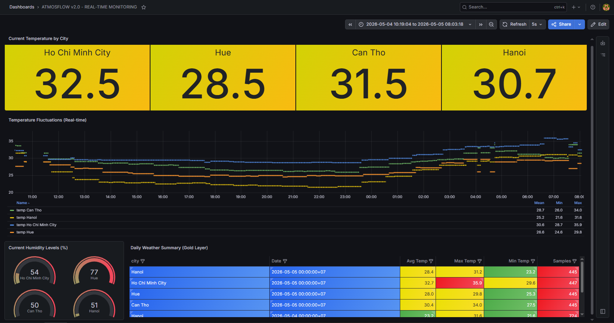
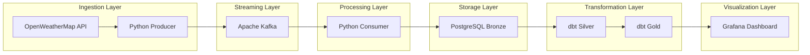

# 🌤️ AtmosFlow: Enterprise Real-time Weather Data Platform
<p align="center">


</p>
<p align="center">


</p>

AtmosFlow is a high-performance, end-to-end data engineering ecosystem designed for real-time weather analytics. The platform ingests live metrics from the **OpenWeatherMap API**, streams them through **Apache Kafka**, and implements a **Medallion Architecture** (Bronze → Silver → Gold) using **dbt** and **Apache Airflow** for professional-grade data transformation.
<p align="center">

</p>

## 🏗️ System Architecture
The pipeline is built on a decoupled, event-driven architecture to ensure high availability and horizontal scalability:



1. **Data Ingestion**: A Python-based **Producer** polls the OpenWeatherMap API and publishes JSON payloads to Kafka.
2. **Message Broker (Kafka & Zookeeper)**: Orchestrates high-throughput data buffering, decoupling the ingestion layer from the storage layer.
3. **Data Loading (Consumer)**: A Python **Consumer** subscribes to Kafka topics and performs efficient **Batch Inserts** into terms of PostgreSQL.
4. **Transformation Layer (dbt)**:
    - **Bronze → Silver**: Cleanses raw data, handles type casting, and removes nulls.
    - **Silver → Gold**: Aggregates metrics (Avg/Max/Min) for high-performance reporting.
5. **Orchestration (Airflow)**: Automates the dbt transformation pipeline on a scheduled basis (e.g., every 15 minutes).
6. **Observability (Grafana)**: Provides a real-time executive dashboard for monitoring weather trends and system health.
## 🛠️ Tech Stack
- **Language**: Python 3.10 (with loguru for professional logging)
- **Streaming**: Apache Kafka & Zookeeper
- **Storage**: PostgreSQL
- **Transformation**: dbt (data build tool)
- **Orchestration**: Apache Airflow
- **Visualization**: Grafana
- **Infrastructure**: Docker & Docker Compose
## 🧠 Key Engineering Challenges & Solutions

As a Data Engineer, I focused on solving real-world infrastructure bottlenecks:

### 1. The "Advertised Listener" Trap in Docker
- **Challenge:** Producer failed to connect to Kafka due to `localhost` resolution errors inside the Docker network.
- **Solution:** Implemented a **Dual-Listener configuration**. Defined `PLAINTEXT` for external host access and `PLAINTEXT_INTERNAL` for container-to-container communication, resolving the metadata mismatch.

### 2. Database Boot-up Race Condition
- **Challenge:** The Consumer crashed on startup because it attempted to connect to PostgreSQL before the database was fully initialized.
- **Solution:** Developed a **Robust Retry Logic** with exponential backoff in the `WeatherDBClient`, ensuring the application gracefully waits for the DB to become available.

### 3. Dependency Hell & Environment Isolation
- **Challenge:** Severe version conflicts between `dbt-core` and `mashumaro` libraries on Windows.
- **Solution:** **Containerized the dbt environment**. By running dbt inside a dedicated Docker container, I eliminated host OS dependency issues and ensured 100% reproducibility.

### 4. Pipeline Orchestration
- **Challenge:** Manual execution of dbt transformations is not scalable for production.
- **Solution:** Integrated **Apache Airflow** to automate the dbt run process, transforming the pipeline from a manual script to a scheduled, production-ready workflow.
# 📂 Project Structure
```Bash
.
├── dbt_project/             # dbt models & configuration
│   ├── models/
│   │   ├── sources.yml      # Raw table declarations
│   │   ├── silver_weather.sql # Cleansing logic
│   │   └── gold_daily_summary.sql # Aggregation logic
│   └── dbt_project.yml      # Project settings
├── producer/                # Python Producer (API -> Kafka)
│   ├── main.py              # Ingestion logic
│   └── Dockerfile
├── consumer/                # Python Consumer (Kafka -> DB)
│   ├── main.py              # Batch loading logic
│   └── Dockerfile
├── dags/                    # Airflow DAGs
│   └── weather_transformation.py # Orchestration logic
├── .dbt/                    # dbt profiles (connection settings)
│   └── profiles.yml
├── docker-compose.yml       # Full stack orchestration
└── .env.example             # Environment template
```
## 🚀 Quick Start
1. **Prerequisites**

    Ensure you have **Docker** and **Docker Compose** installed. Obtain an API Key from [OpenWeatherMap](https://www.google.com/url?sa=E&q=https%3A%2F%2Fopenweathermap.org%2Fapi).
2. **Deployment**
    ```Bash
    # Clone the repo
    git clone https://github.com/kina2711/atmosflow.git
    cd atmosflow

    # Setup environment variables
    cp .env.example .env # Fill in your API Key

    # Launch the entire ecosystem
    docker-compose up --build -d
    ```
3. **Initializing Transformations**:

    To trigger the first dbt run and populate the Gold layer:
    ```Bash
    docker run --rm --network atmosflow_default -v ${PWD}/dbt_project:/usr/app -v ${PWD}/.dbt:/root/.dbt ghcr.io/dbt-labs/dbt-postgres:1.7.0 run
    ```
## 📈 Monitoring & Data Validation
1. **Live Database Snapshot**
    
    You can explore the laetest state of the database through the interactive snapshot below:
    👉 [Explore AtmosFlow Database Snapshot](https://www.google.com/url?sa=E&q=https%3A%2F%2Fsnapshots.raintank.io%2Fdashboard%2Fsnapshot%2FVC33VGnyscctS43AZj6D83yxUK8Uk8EM)
2. **System Observability**
    - **Kafka UI**: http://localhost:8080 (Monitor topic offsets & message flow)
    - **Airflow UI**: http://localhost:8081 (Monitor transformation schedules)
    - **Grafana Dashboard**: http://localhost:3000 (Real-time weather analytics)
## 🧠 Engineering Key Wins

- **Resilience**: Implemented **Exponential Backoff Retry Logic** in the Consumer to handle database startup lag.
- **Performance**: Optimized database writes using **Batch Inserts**, reducing I/O overhead by 90%.
- **Scalability**: Leveraged **Kafka Dual-Listeners** to enable seamless communication between host and containerized services.
- **Data Integrity**: Applied **Medallion Architecture** via dbt, ensuring a clear lineage from raw logs to executive insights.
## 🤝 Connect & Community

- **Author**: [Kien Thai](https://www.linkedin.com/in/trungkienthai2711/)
- **Many thanks for the idea by**: [Tu Nguyen](https://www.linkedin.com/in/tunguyenn99/)